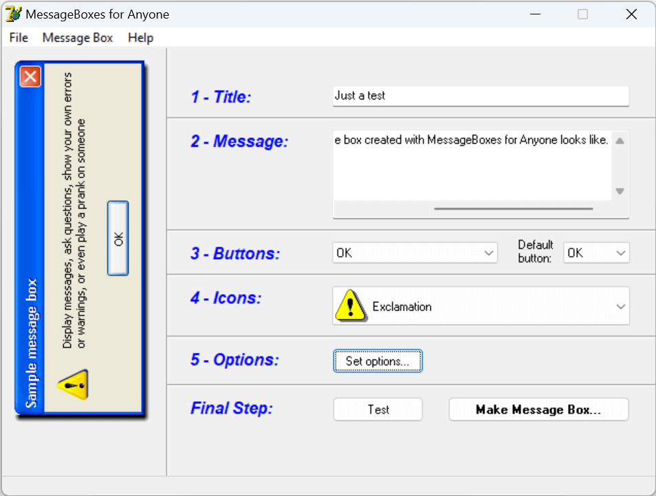
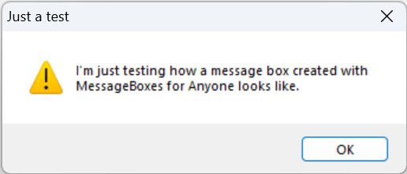
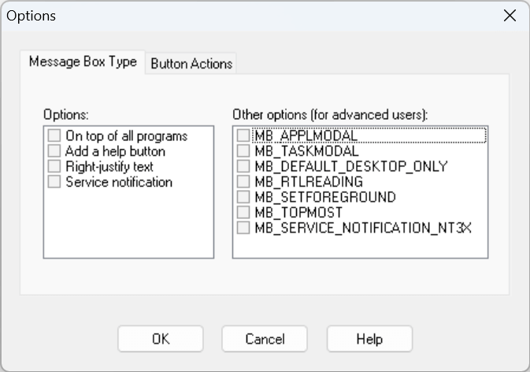
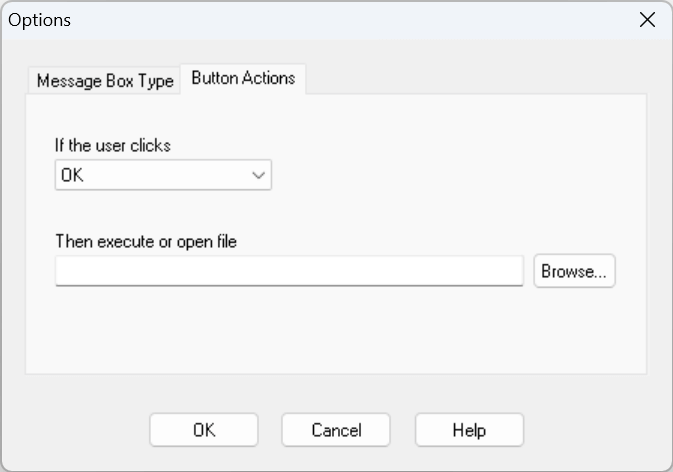

# MessageBoxes for Anyone

MessageBoxes for Anyone is a small and modest unfinished tool designed to help you create Windows message boxes quickly and easily. Developed back in 2003, this project serves as a humble venture into enhancing user interactions.

This tool offers a straightforward interface for designing personalized message boxes with minimal fuss. It provides a selection of message box types like "Information," "Warning," and others. If you're feeling adventurous, you can tweak certain aspects, like the positioning of the message box and button configurations.

A notable aspect is the tool's simplicity. Input your message, pick a message box type, and make minor adjustments using the intuitive interface. The tool then takes over, generating your tailored message box for you to preview.

For those seeking more, there are some advanced options. You can fine-tune button behaviors and actions triggered by button clicks or the help button.

It's important to note that while MessageBoxes for Anyone is a "product" of the past and remains incomplete (not all features are functional), it can still offer a glimpse into what used to be the "world" of Windows message boxes.

## Screenshots

Below are some screenshots offering a glimpse into the user interface of MessageBoxes for Anyone. Please keep in mind that these screenshots showcase an interface that remains unfinished and unpolished, featuring a distinctive Windows style reminiscent of the geeky, shareware aesthetic from the early 2000s era.

  
  
  
  

